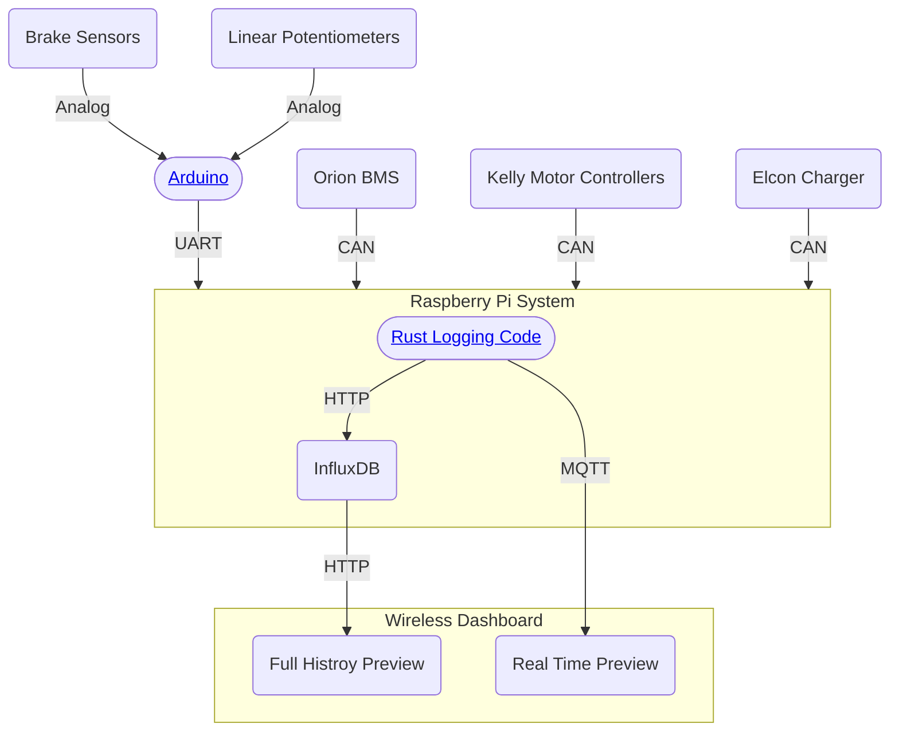

# Architecture

# Development Environment
## Devcontainer
- Install the [Devcontainer](https://marketplace.visualstudio.com/items?itemName=ms-vscode-remote.remote-containers) extension for VSCode
- Open the project in VSCode
- Open the command palette (Super+Shift+P) and run `Dev Containers: Rebuild and Reopen in Container`
- The project will now be running in a container with all the necessary dependencies (rust) and services (grafana, influxdb)
- Now run `cargo run` to start the logging service
- You can view the dashboard at `http://localhost:3000` (default username: admin, password: admin)