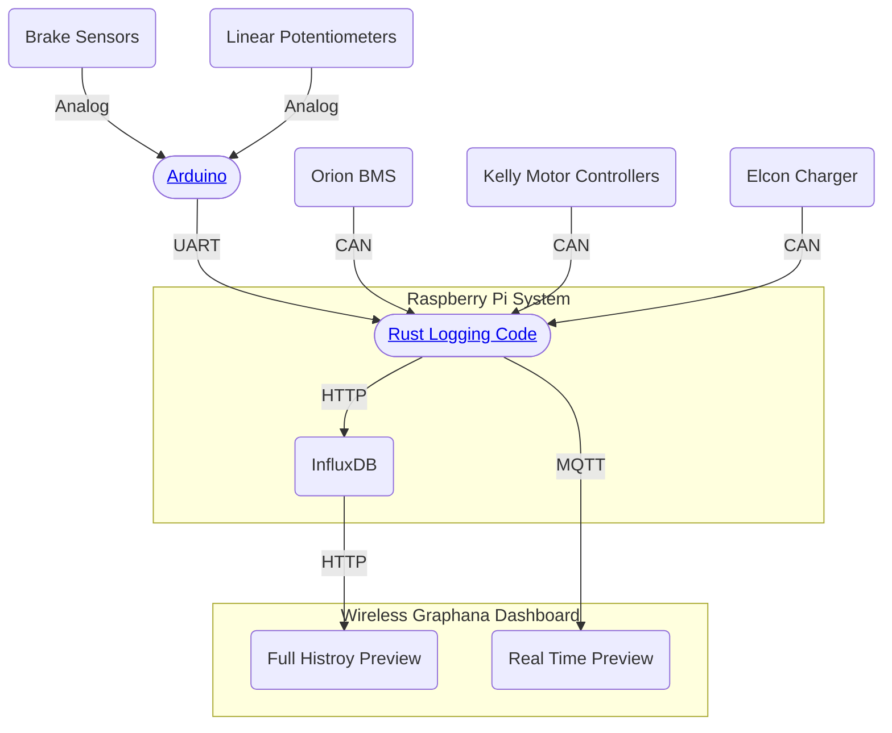

```mermaid
flowchart TD
    B(Brake Sensors) -->|Analog| A(["<a href='https://github.com/AlistairKeiller/FSAE/tree/master/fsae-arduino' target='_blank'>Arduino</a>"])
    L(Linear Potentiometers) -->|Analog| A(["<a href='https://github.com/AlistairKeiller/FSAE/tree/master/fsae-arduino' target='_blank'>Arduino</a>"])
    A(["<a href='https://github.com/AlistairKeiller/FSAE/tree/master/fsae-arduino' target='_blank'>Arduino</a>"]) -->|UART| R(["<a href='https://github.com/AlistairKeiller/FSAE/tree/master/fsae-raspi' target='_blank'>Rust Logging Code</a>"])
    O(Orion BMS) -->|CAN| R(["<a href='https://github.com/AlistairKeiller/FSAE/tree/master/fsae-raspi' target='_blank'>Rust Logging Code</a>"])
    K(Kelly Motor Controllers) -->|CAN| R(["<a href='https://github.com/AlistairKeiller/FSAE/tree/master/fsae-raspi' target='_blank'>Rust Logging Code</a>"])
    IMS(Elcon Charger) -->|CAN| R(["<a href='https://github.com/AlistairKeiller/FSAE/tree/master/fsae-raspi' target='_blank'>Rust Logging Code</a>"])
    subgraph Pi[Raspberry Pi System]
        R(["<a href='https://github.com/AlistairKeiller/FSAE/tree/master/fsae-raspi' target='_blank'>Rust Logging Code</a>"]) -->|HTTP| I(InfluxDB)
    end
    subgraph Graphana[Wireless Graphana Dashboard]
        I(InfluxDB) -->|HTTP| F(Full Histroy Preview)
        R(["<a href='https://github.com/AlistairKeiller/FSAE/tree/master/fsae-raspi' target='_blank'>Rust Logging Code</a>"]) -->|MQTT| P(Real Time Preview)
    end Graphana[Graphana]
```