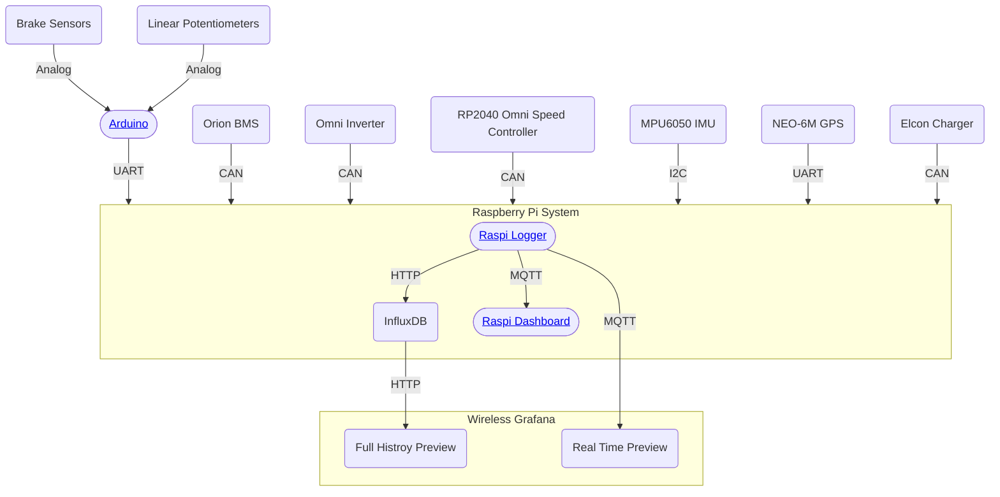

# Architecture

# Development Environment

## fsae-raspi

- Open the project in VSCode
- Install the [Devcontainer](https://marketplace.visualstudio.com/items?itemName=ms-vscode-remote.remote-containers) extension for VSCode
- Open the command palette (Super+Shift+P) and run `Dev Containers: Rebuild and Reopen in Container`
- The project will now be running in a container with all the necessary dependencies (rust) and services (grafana, influxdb)
- Now run `cargo run --bin fsae-raspi` to start the logging service
- You can view the dashboard at `http://localhost:3000` (default username: admin, password: admin)
- You can view the influxdb database (`http://localhost:8086`) or mqtt broker (`localhost:1883`), by adding it as a data source in grafana

## fsae-arduino

- Plug in the Arduino
- Open the project in VSCode
- Install the [PlatformIO](https://marketplace.visualstudio.com/items?itemName=platformio.platformio-ide) extension for VSCode
- Open the command palette (Super+Shift+P) and run `PlatformIO: Upload`
- The code will now be running on the Arduino

## fsae-dashboard

- Open the project in VSCode
- Now run `cargo run --bin fsae-dashboard` to start the dashboard
