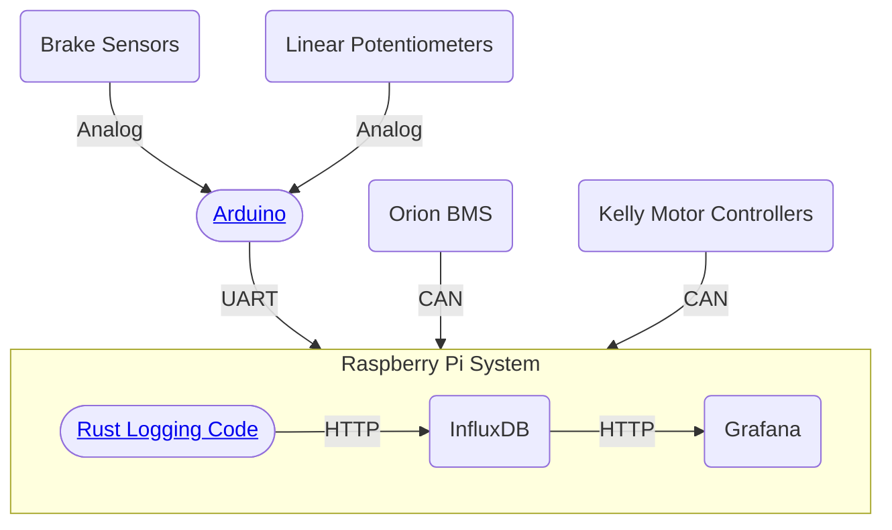

```mermaid
flowchart TD
    B(Brake Sensors) -->|Analog| A(["<a href='https://github.com/AlistairKeiller/FSAE/tree/master/fsae-arduino' target='_blank'>Arduino</a>"])
    L(Linear Potentiometers) -->|Analog| A(["<a href='https://github.com/AlistairKeiller/FSAE/tree/master/fsae-arduino' target='_blank'>Arduino</a>"])
    A(["<a href='https://github.com/AlistairKeiller/FSAE/tree/master/fsae-arduino' target='_blank'>Arduino</a>"]) -->|UART| Pi[Raspberry Pi System]
    O(Orion BMS) -->|CAN| Pi[Raspberry Pi System]
    K(Kelly Motor Controllers) -->|CAN| Pi[Raspberry Pi System]
    subgraph Pi[Raspberry Pi System]
        R(["<a href='https://github.com/AlistairKeiller/FSAE/tree/master/fsae-raspi' target='_blank'>Rust Logging Code</a>"]) -->|HTTP| I(InfluxDB)
        I(InfluxDB) -->|HTTP| G(Grafana)
    end
```